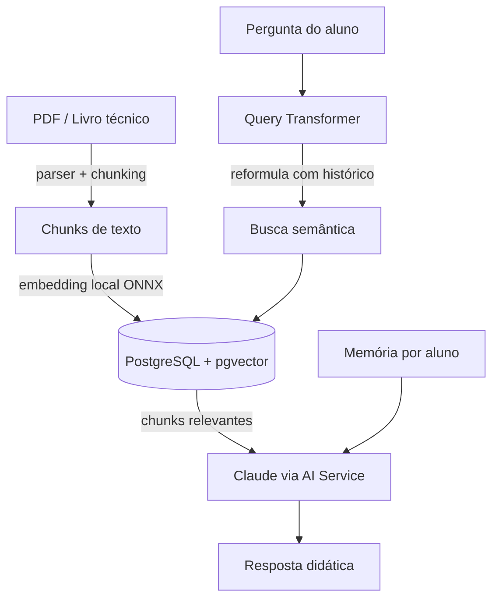

# 🎓 CodeMentor.java

> Um agente de IA professor de programação, construído em Java com Spring Boot, LangChain4j e RAG (Retrieval-Augmented Generation).

## Sobre o projeto

CodeMentor é um assistente de ensino de programação que responde perguntas de alunos iniciantes de forma didática e guiada — priorizando explicar o raciocínio em vez de só entregar a resposta pronta. As respostas são fundamentadas numa base de conhecimento real: livros e materiais técnicos em PDF, indexados via busca semântica.

Projeto desenvolvido como capstone de um roadmap de transição de carreira para desenvolvimento backend Java + IA.

## ✨ Funcionalidades

- 📚 **Ingestão de documentos** — PDFs são convertidos em chunks, transformados em embeddings e armazenados em um banco vetorial
- 🔍 **Busca semântica (RAG)** — perguntas do aluno são respondidas com base no conteúdo real dos documentos ingeridos
- 🧠 **Memória de conversa por aluno** — cada usuário tem seu próprio histórico, isolado dos demais
- 🔄 **Busca ciente de contexto** — perguntas de seguimento ("me dê um exemplo disso") são reformuladas automaticamente usando o histórico da conversa antes de buscar no banco
- 🔐 **Autenticação JWT** — registro, login e rotas protegidas
- 📖 **Documentação automática** — Swagger/OpenAPI gerado a partir do código
- 💰 **Custo zero de embeddings** — modelo de embedding roda localmente (ONNX), sem depender de API paga

## 🏗️ Arquitetura



## 🛠️ Stack técnica

| Camada | Tecnologia |
|---|---|
| Linguagem | Java 21 |
| Framework | Spring Boot 4 |
| Orquestração de IA | LangChain4j |
| LLM | Claude (Anthropic API) |
| Embeddings | AllMiniLM-L6-v2, local via ONNX Runtime |
| Banco vetorial | PostgreSQL + pgvector |
| Autenticação | Spring Security + JWT |
| Documentação | springdoc-openapi (Swagger UI) |
| Infraestrutura | Docker |

## 🚀 Como rodar localmente

### Pré-requisitos

- Java 21+
- Docker
- Uma [API key da Anthropic](https://console.anthropic.com)

### 1. Clone o repositório

```bash
git clone https://github.com/vinipenido/codementor-java.git
cd codementor-java
```

### 2. Suba o banco de dados

```bash
docker compose up -d
```

### 3. Configure as variáveis de ambiente

| Variável | Descrição |
|---|---|
| `ANTHROPIC_API_KEY` | Sua chave da API da Anthropic |
| `JWT_SECRET` | Chave secreta para assinar os tokens JWT — gere com `openssl rand -base64 32` |
| `DB_PASSWORD` | Senha do banco local (deve bater com a definida no `docker-compose.yml`) |

### 4. Rode a aplicação

```bash
./mvnw spring-boot:run
```

### 5. Acesse a documentação interativa

```
http://localhost:8080/swagger-ui/index.html
```

### 6. Primeiro uso: registre um usuário e adicione uma base de conhecimento

> ⚠️ **O banco de dados sobe vazio.** Nenhum PDF ou usuário vem pré-cadastrado no repositório — o material usado durante o desenvolvimento não é redistribuído aqui. Para testar o projeto, siga os passos abaixo com um PDF de sua escolha (de domínio público ou de sua própria autoria).

**a) Registre um usuário:**
```bash
curl -X POST "http://localhost:8080/api/auth/registrar?email=seu@email.com&senha=suasenha"
```

**b) Faça login para obter o token JWT:**
```bash
curl -X POST "http://localhost:8080/api/auth/login?email=seu@email.com&senha=suasenha"
```
A resposta é o próprio token — copie-o para os próximos passos.

**c) Ingira um PDF na base de conhecimento** (substitua pelo caminho do seu arquivo e pelo token obtido acima):
```bash
curl -G "http://localhost:8080/api/ingest" \
  --data-urlencode "filePath=/caminho/completo/para/seu/livro.pdf" \
  -H "Authorization: Bearer SEU_TOKEN_AQUI"
```

**d) Pergunte ao professor:**
```bash
curl -G "http://localhost:8080/api/professor" \
  --data-urlencode "pergunta=o que é uma variável em java" \
  -H "Authorization: Bearer SEU_TOKEN_AQUI"
```

Todos esses passos também podem ser executados pela interface do Swagger (passo 5), sem precisar do `curl`.

## 📡 Principais endpoints

| Método | Endpoint | Descrição | Autenticação |
|---|---|---|---|
| `POST` | `/api/auth/registrar` | Cadastra um novo usuário | Não |
| `POST` | `/api/auth/login` | Autentica e retorna um token JWT | Não |
| `GET` | `/api/ingest` | Ingere um novo PDF na base de conhecimento | Sim |
| `GET` | `/api/professor` | Faz uma pergunta ao professor de IA | Sim |
| `GET` | `/api/search` | Busca semântica bruta (endpoint de diagnóstico) | Sim |
| `GET` | `/api/chat` | Chat direto com o Claude, sem RAG (comparação) | Sim |

## 🗺️ Roadmap

- [ ] Ingestão assíncrona para PDFs grandes (atualmente síncrona)
- [ ] Ingestão em lote (múltiplos documentos de uma vez)
- [ ] Deploy em produção
- [ ] Testes automatizados
- [ ] Tratamento de erros mais refinado nos endpoints de autenticação

## 📄 Licença

Este projeto está sob a licença MIT. Os documentos usados para popular a base de conhecimento durante o desenvolvimento **não estão incluídos** neste repositório e não são cobertos por esta licença.
